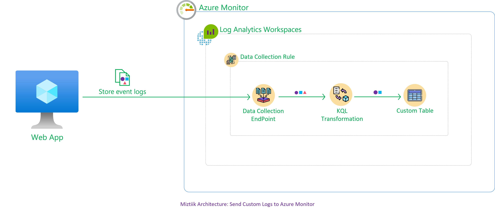

# Create Azure VM

The developer at Mystique Unicorn are looking monitor their app from the custom logs generated by the app running inside a Azure VM 
Can you show them how the can get started ?

## 🎯 Solutions

We will use Azure Monitor Agent<sup>[1]</sup> to collect the application logs from a specified location(_for exampe: `/var/log/miztiik*.json`_) and push them to a Log Analytics Workspace<sup>[3]</sup>. To receive the logs in the correct format we need to define a custom table<sup>[5],[6]</sup> and a data collection rule. The rule will collect logs from our _source_(VM App), transform the logs using Kusto Query Language(KQL) to a structure defined in the custom table and store them in the _sink_(log analytics workspace).

This repository holds the bicep code to deploy the necessary infrastructure for this demo,
- Virtual Machine(RedHat) inside a Vnet with public access.
  - Bootstrapped with custom libs using `customData` script.
- Log Analytics Workspace
  - Custom Table
  - Data Collection Endpoint - With publicaccess
  - Data Collection Rule
    - Configured with the log location, KQL query and custom table




1. ## 🧰 Prerequisites

   This demo, instructions, scripts and bicep template is designed to be run in `westeurope`. With few or no modifications you can try it out in other regions as well(_Not covered here_).

   - 🛠 Azure CLI Installed & Configured - [Get help here](https://learn.microsoft.com/en-us/cli/azure/install-azure-cli)
   - 🛠 Bicep Installed & Configured - [Get help here](https://learn.microsoft.com/en-us/azure/azure-resource-manager/bicep/install)
   - 🛠 VS Code & Bicep Extenstions - [Get help here](https://learn.microsoft.com/en-us/azure/azure-resource-manager/bicep/install#vs-code-and-bicep-extension)

2. ## ⚙️ Setting up the environment

   - Get the application code

     ```bash
     https://github.com/miztiik/send-vm-logs-to-azure-monitor
     cd send-vm-logs-to-azure-monitor
     ```

3. ## 🚀 Prepare the environment

   Let check you have Azure Cli working with 

    ```bash
      # You should have azure cli preinstalled
      az account show
    ```

    You should see an output like this,

   ```json
    {
      "environmentName": "AzureCloud",
      "homeTenantId": "16b30820b6d3",
      "id": "1ac6fdbff37cd9e3",
      "isDefault": true,
      "managedByTenants": [],
      "name": "YOUR-SUBS-NAME",
      "state": "Enabled",
      "tenantId": "16b30820b6d3",
      "user": {
        "name": "miztiik@",
        "type": "user"
      }
    }
   ```

4. ## 🚀 Deploying the application

   Let us walk through each of the stacks,

   - **Stack: Main Bicep**
     The params required for the modules are in `params.json`. Do modify them to suit your need.(_Especially the `adminPassword.secureString` for the VM. You are strongly encouraged to Just-In-Time access or use SSH key instead of password based authentication_). The helper deployment script `deploy.sh` will deploy the `main.bicep` file. This will inturn call the modules for Resource Group(RG), VNet & Virtual Machine, Log analytics workspace, Custom table, Data collection endpoint, Data collection rule(DCR) and finally attach the DCR to the VM.

     ```bash
     sh deploy.sh
     ```

     This stack will create almost all of the resoureces. The RG is created as a deployment at the subscription level. The other resources are deployments at resource group level. 

     - **Virtual Machine** - A Redhat vm is bootstrapped using `customData` to install python3, git. We will use a bash script `generate_data.sh`. It will generate a json conformant log in this location `/var/log/miztiik-yyyy-MM-dd.json` for example _`/var/log/miztiik-2023-04-03.json`_. All new entries are appended to the file with `new-line` being the delimitter as expected by Azure Custom Logs.

        ```json
        {"request_id": "08b6b258-c6d6-44ff-802e-69d52422095a", "event_type": "inventory_event", "store_id": 45, "cust_id": 4416, "category": "Camera", "sku": 17293, "price": 44.61, "qty": 15
        , "discount": 73.2, "gift_wrap": 0, "variant": "MystiqueAutomatoon", "priority_shipping": 1, "TimeGenerated": "2023-04-03T10:54:23", "contact_me": "github.com/miztiik" }
        {"request_id": "60051c39-6817-4f52-bd8f-59cc9a38be0f", "event_type": "inventory_event", "store_id": 64, "cust_id": 4081, "category": "Camera", "sku": 17815, "price": 50.92, "qty": 16
        , "discount": 29.2, "gift_wrap": 1, "variant": "MystiqueAutomatoon", "priority_shipping": 0, "TimeGenerated": "2023-04-03T10:54:24", "contact_me": "github.com/miztiik" }
        {"request_id": "f340f343-fc0f-40a1-b9f5-2abdd14b929d", "event_type": "inventory_event", "store_id": 35, "cust_id": 338, "category": "Camera", "sku": 16158, "price": 53.76, "qty": 13,
        "discount": 34.3, "gift_wrap": 1, "variant": "MystiqueAutomatoon", "priority_shipping": 0, "TimeGenerated": "2023-04-03T10:54:25", "contact_me": "github.com/miztiik" }
        ```
        
        Formatting a single log line entry properly, will look like this,

        ```json
        {
          "request_id": "f5570d0f-5389-4bce-98c3-7ed5380eefb2",
          "event_type": "inventory_event",
          "store_id": 6,
          "cust_id": 206,
          "category": "Camera",
          "sku": 100657,
          "price": 2.52,
          "qty": 18,
          "discount": 8.2,
          "gift_wrap": true,
          "variant": "red",
          "priority_shipping": true,
          "TimeGenerated": "2021-04-25T12:52:40.938937",
          "contact_me": "github.com/miztiik"
        }
        ```

     After successfully deploying the stack, Check the `Resource Groups/Deployments` section for the resources.


5. ## 🔬 Testing the solution

   1. **Connect to the VM**

    Connect to the VM using Just-In-Time access. This should allow your IP/IP list to securelly connect to your VM using private IP address. Use the password you updated in the `params.json`

    ```bash
    ssh miztiik@publicIP
    ```

    

  1. **Troubleshooting Azure Monitor Agent**

      - In case if you are facing issues, log into the  VM and check the logs `/var/log/azure/Microsoft.Azure.Monitor.AzureMonitorLinuxAgent/` for potential causes.
      - From the portal, you can query to find if the agent is reporting to Azure Monitor

        ```sh
        Heartbeat | where Category == "Azure Monitor Agent" and Computer == "<computer-name>" | take 10
        ```

        Check if the AMA is running,

        ```sh
        systemctl status azuremonitoragent
        ```

      
6. ## 📒 Conclusion

Here we have demonstrated how to bicep to create Resource groups, Vnets and VMs

2. ## 🧹 CleanUp

If you want to destroy all the resources created by the stack, Execute the below command to delete the stack, or _you can delete the stack from console as well_

- Resources created during [Deploying The Application](#-deploying-the-application)
- _Any other custom resources, you have created for this demo_

```bash
# Delete from resource group
az group delete --name Miztiik_Enterprises_001 --yes
# Follow any on-screen prompts
```

This is not an exhaustive list, please carry out other necessary steps as maybe applicable to your needs.

## 📌 Who is using this

This repository aims to show how to Bicep to new developers, Solution Architects & Ops Engineers in Azure.

### 💡 Help/Suggestions or 🐛 Bugs

Thank you for your interest in contributing to our project. Whether it is a bug report, new feature, correction, or additional documentation or solutions, we greatly value feedback and contributions from our community. [Start here](/issues)

### 👋 Buy me a coffee

[](https://ko-fi.com/Q5Q41QDGK) Buy me a [coffee ☕][900].

### 📚 References


1. [Azure Docs: Azure Monitor Agent Overview][1]
1. [Azure Docs: Azure Monitor Agents -vs- Other Agatnes Overview][2]

1. [Azure Docs: Collect text logs with Azure Monitor Agent][3]
1. [Azure Docs: Collect text logs with Log Analytics Agent][4]
1. [Azure Docs: Custom Table][5]
1. [Azure Docs: Workspace Table Creation][6]
1. [Azure Docs: Log Data Plan Basic-vs-Analytics Comparison][7]
1. [Azure Docs: Custom Log Ingestion using python SDK][8]
1. [Azure Docs: Custom Metrics to Azure Monitor][9]
1. [Azure Docs: Check Logs in Azure Logs][10]
1. [Azure Docs: Troubleshoot Azure Monitor Agent][11]
1. [Azure Docs: Sample Data Collection Rule][12]


### 🏷️ Metadata


**Level**: 200

[1]: https://learn.microsoft.com/en-us/azure/azure-monitor/agents/agents-overview
[2]: https://learn.microsoft.com/en-us/azure/azure-monitor/agents/agents-overview#compare-to-legacy-agents
[3]: https://learn.microsoft.com/en-us/azure/azure-monitor/agents/data-collection-text-log
[4]: https://learn.microsoft.com/en-us/azure/azure-monitor/agents/data-sources-custom-logs
[5]: https://learn.microsoft.com/en-us/azure/azure-monitor/agents/data-collection-text-log?tabs=portal#create-a-custom-table
[6]: https://learn.microsoft.com/en-us/azure/templates/microsoft.operationalinsights/workspaces/tables?pivots=deployment-language-bicep
[7]: https://learn.microsoft.com/en-us/azure/azure-monitor/logs/basic-logs-configure?tabs=portal-1
[8]: https://learn.microsoft.com/en-us/python/api/overview/azure/monitor-ingestion-readme?view=azure-python
[9]: https://learn.microsoft.com/en-us/azure/azure-monitor/essentials/metrics-custom-overview
[10]: jsonContext
[11]: https://learn.microsoft.com/en-us/azure/azure-monitor/logs/log-analytics-overview
[11]: https://learn.microsoft.com/en-us/azure/azure-monitor/logs/data-collection-rule-sample-custom-logs


[100]: https://www.udemy.com/course/aws-cloud-security/?referralCode=B7F1B6C78B45ADAF77A9
[101]: https://www.udemy.com/course/aws-cloud-security-proactive-way/?referralCode=71DC542AD4481309A441
[102]: https://www.udemy.com/course/aws-cloud-development-kit-from-beginner-to-professional/?referralCode=E15D7FB64E417C547579
[103]: https://www.udemy.com/course/aws-cloudformation-basics?referralCode=93AD3B1530BC871093D6
[899]: https://www.udemy.com/user/n-kumar/
[900]: https://ko-fi.com/miztiik
[901]: https://ko-fi.com/Q5Q41QDGK